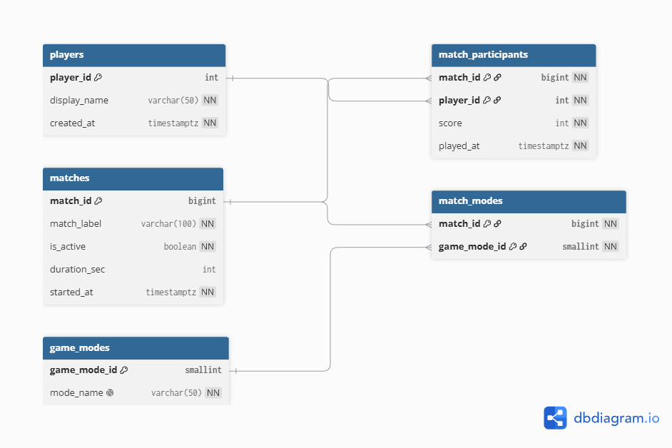

# EX 603 — Game Telemetry Database

A relational database modelling the telemetry backend of a competitive
multiplayer game: players compete in matches, each match is played under one or
more game modes, and every player's result in a match is recorded as a scored
event.

**Theme:** Game Telemetry (Theme 3)

## Domain

This project models the data layer behind a competitive online game — the store
that sits under the ranked ladder, the match-history screen, and the end-of-season
stats. Every time a match finishes, the game server records who played, in which
match, under which mode, and how each player performed. Over many matches those
records become the raw material for leaderboards, matchmaking, and balance
decisions.

The design uses five entities. Players are the actors on the platform. Matches are
the game sessions they take part in, each flagged as live or completed and carrying
a duration. Game modes classify matches (Ranked Solo, Team Deathmatch, and so on),
linked to matches through a match–modes junction that allows a match to carry more
than one mode. Match participants is the high-volume fact table: one row per player
per match, holding the score and the time the result was recorded.

The platform must answer questions such as: which players have the highest average
score, and over how many matches? Which game modes are played most often? How many
matches are still active versus completed? What is the score distribution within a
mode? Those questions drive the queries built in later units; the score column on
match participants is the metric they aggregate.

## Entity Relationship Diagram

## Schema

Full relation schemas, domains, and primary keys are in
[schema/schema-definition.md](schema/schema-definition.md); the constraints and
`ON DELETE` justifications are in [schema/constraints.md](schema/constraints.md).
The modelling justification and reflection are in
[analysis/unit1.md](analysis/unit1.md).